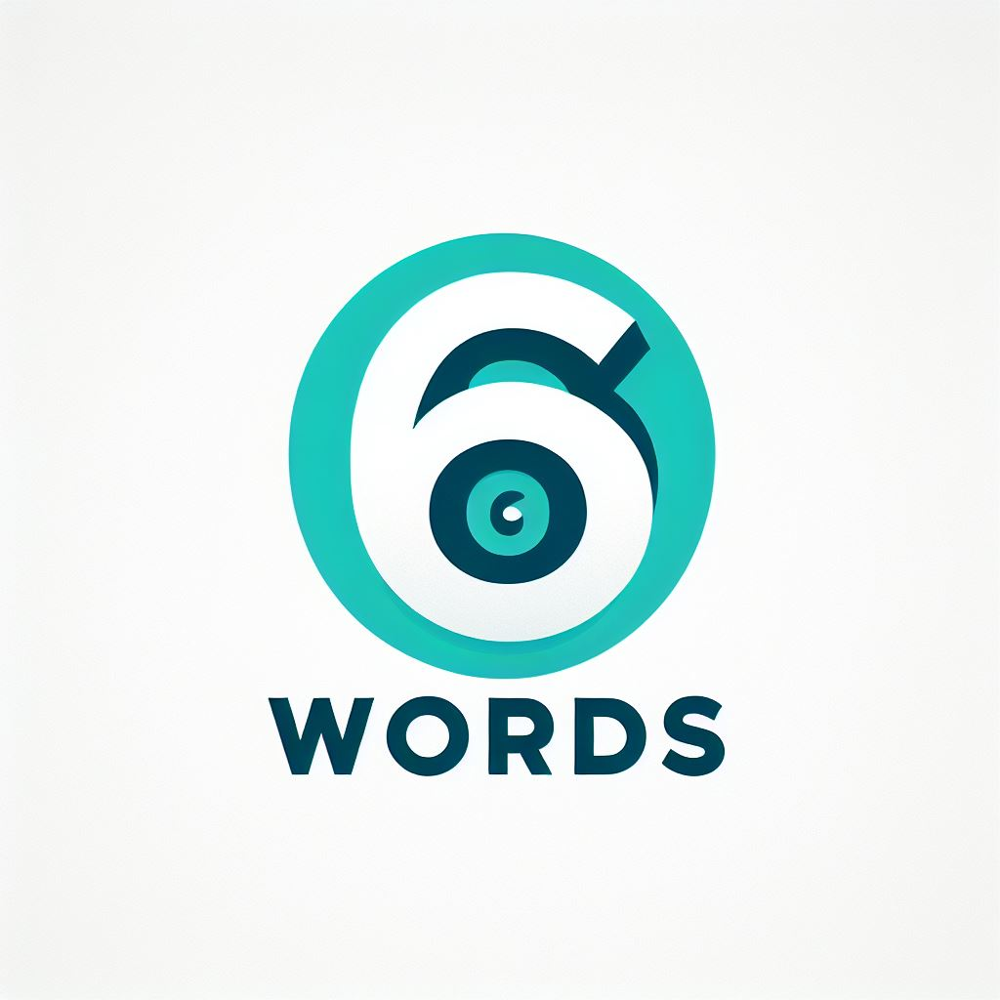
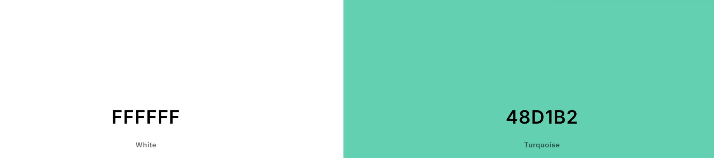

    
  
  # **6 Words**

  #### 6 Words is a diary that challenges you to express your day using only 6 words.

  

  COLOR PALETTE            |  DEMO
:-------------------------:|:-------------------------:
   |  <video width=100% controls><source src="preview.mp4" type="video/mp4">DEMO Video</video>

## **KEY FEATURES:**
The user will be able to make diary entries, as well as looking through all the entries that have been made already.
There's also a function where they can go and see which of the entries they've favorited.
## **HOW TO USE (Visual Studio Code)**

1. You will need to launch Head Space through your browser.

2. You will be directed to the home page which displays where you can make a diary entry.

3. You can either make a entry and it will be displayed on the home page and you can view the entries you've favorited and you can also view why I created my project.